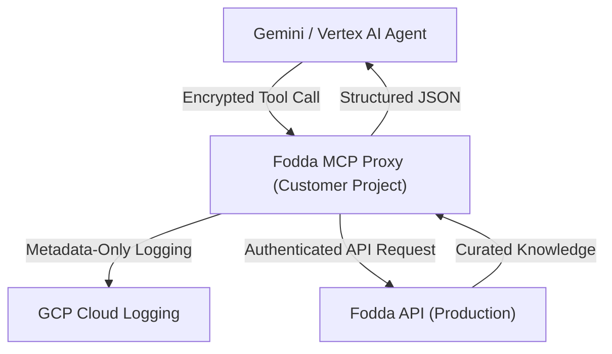

# Fodda MCP — Security & Procurement Summary

This document provides a technical and governance overview of the Fodda MCP layer for enterprise security and procurement teams.

## 1. Governance Overview

| Question | Answer |
| :--- | :--- |
| **Data Ingestion** | Fodda does **not** ingest client proprietary data. |
| **Model Training** | Fodda does **not** train models on client queries or data. |
| **Data Retention** | **Zero-retention** policy for prompt text and response bodies. |
| **Authentication** | API Key (Individual or Shared Account) or OAuth2 Bearer Tokens. |
| **Access Control** | Per-graph and per-tenant isolation enforced at the API layer. |

## 2. Architecture & Data Flow (Model B)

In the enterprise-preferred **Model B** deployment, the MCP proxy is hosted within the customer's own Google Cloud project (Cloud Run), ensuring full control over network and IAM.



## 3. Security Controls

- **Encryption**: TLS 1.2+ for all data in transit.
- **Privacy Guardrails**: The MCP proxy is designed to log only metadata (tool name, latency, status). It does not record the `query` or the `response` content.
- **Stateless Design**: No persistent storage, session memory, or prompt caching.
- **Deterministic Enforcement**: All requests are forced to `deterministic` mode, eliminating non-deterministic behavior that can be exploited for data exfiltration via LLM state.

## 4. Auditability

The MCP server outputs standard JSON logs to `stderr`, which are captured by the host environment (e.g., Cloud Run logging):

```json
{
  "event": "mcp.tool_call",
  "tool": "get_evidence",
  "graphId": "psfk",
  "userId": "user-123",
  "status": 200,
  "durationMs": 145,
  "deterministic": true
}
```

## 5. Contact Information

For technical deep-dives or full SOC2 reports, please contact:
**Security Team**: security@fodda.ai
